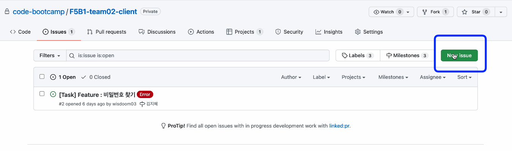
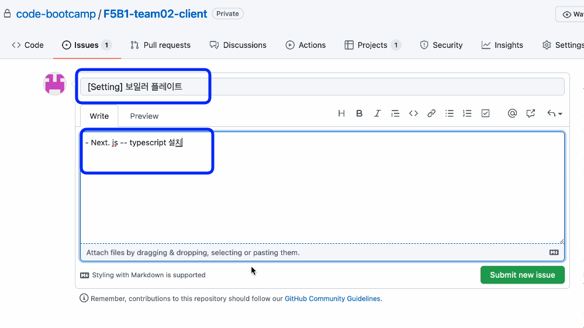
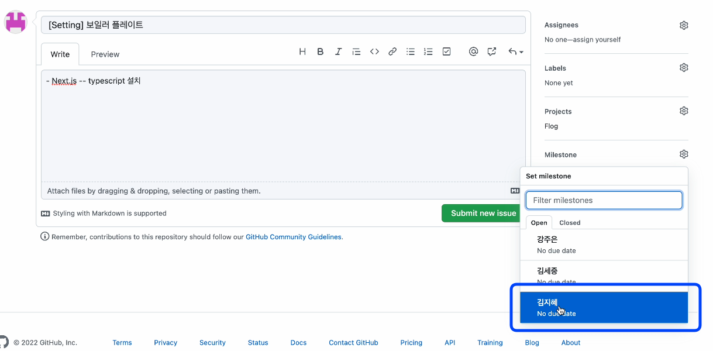
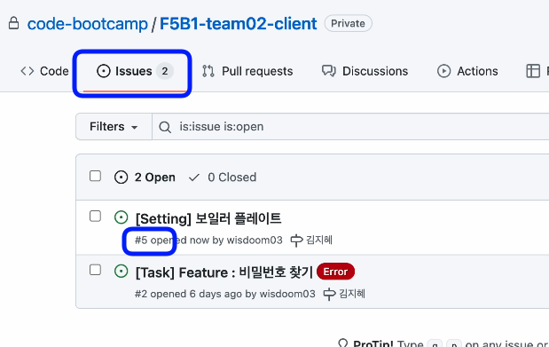
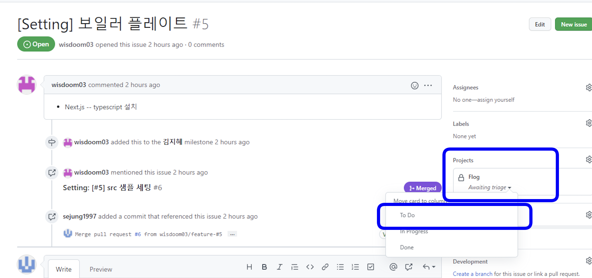
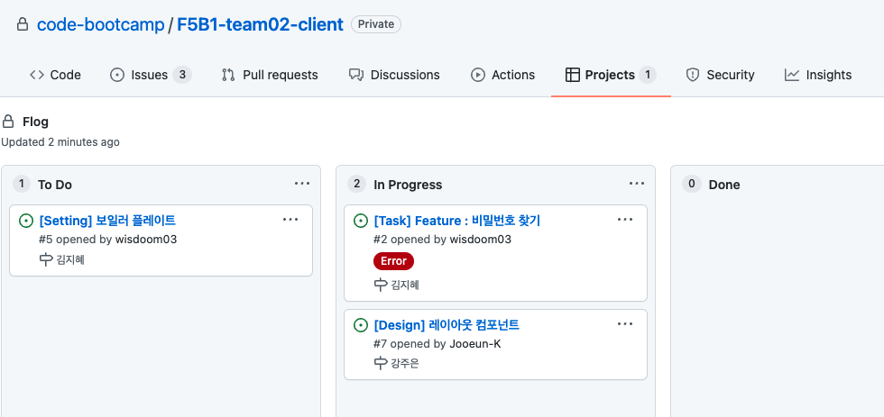
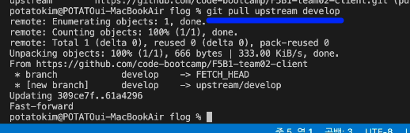
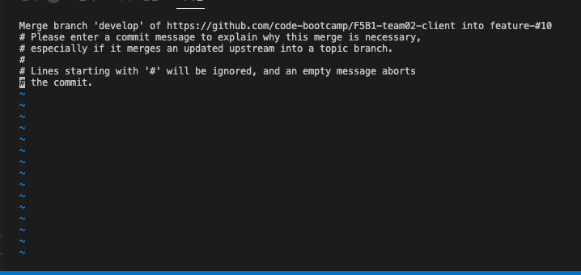
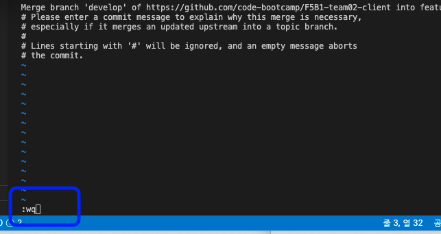

# Manual for git

## github 에서 repository 를 fork 하기

- github 에서 fork 버튼을 누른다.
- fork 된 repository 는 자신의 repository 가 되며, 이 repository 를 clone 한다.

## git clone

- fork 된 repository 를 clone 한다.

## 작업 전에 issue를 생성

### 1. New issue를 클릭합니다



### 2. issue 형식에 맞춰서 내용을 작성합니다



**issue 형식**

```markdown
[타입] Issue 내용 <label>

타입: Feat, Design, Setting 에서 선택
Issue 내용: 한글로 간결하게 작성.
label: 해당하는 내용이 있는 경우 label 적극 사용

ex)
[Feat] 일정 예산 프로그레스 바
[Feat] 나의 여행 게시물 공유
[Design] 마이페이지 레이아웃
[Setting] 보일러 플레이트

**라벨 작성**

BugFix : 버그 픽스 완료
Error : 에러발생
Need yarn install : package.json 업데이트 필요
```

---

### 3. Project, Milestone 지정




---

### 4. issue number 확인



짜잔 이슈 넘버가 생성되었습니다 #5

---

### 5. To Do 설정



다시 해당 issue로 들어가서 projects - todo 설정을 합니다



기능 개발이 시작되면 칸반보드의 to do 컬럼에 있는 해당 기능을 In progress로 옮기고,
기능 개발이 완료되면 issue를 close하고, 칸반보드에서 해당 기능을 Done으로 옮겨주세요.

마일스톤을 통해 개인별 태스크 진행 상황을 확인할 수 있고, 칸반보드를 통해 프로젝트 전체의 진행 상황을 확인할 수 있습니다.

---

### 6. Label 설정


특이사항은 라벨을 달아주세요!

**Label 형식**

```markdown
**라벨 작성**

BugFix : 버그 픽스 완료
Error : 에러발생
Need yarn install : package.json 업데이트 필요
```

## 로컬에서 작업하기

### 1. 생성한 issue number로 branch를 생성합니다

.png>)

```bash
Branch 이름 형식

git checkout -b#이슈넘버
```

---

### 2. 해당 branch에 들어와 있는지 확인합니다

.pngg>)

```bash
git branch
```

---

### 3. 형식에 맞춰 commit message를 작성합니다

.png>)

**Commit message 형식**

```markdown
**전체 양식**
Type: [#issue] 세부기능명

- **Type**
  첫 글자는 무조건 대문자로 입력한다.
  :의 앞은 공백 없이, 뒤에는 공백 한 개를 넣는다.

- **[#issue]**
  대괄호 안에 #issue-number 를 입력한다.
  issue가 없을 경우에는 생략.

- **세부기능명**
  개조식 구문으로 작성한다.
  마침표는 넣지 않는다.

**예시**
Feat: [#12] 로그인 페이지 추가 , 회원가입 기능 추가
Error: 상품리스트 불러오기
Design: [#24] 메인화면 UI 변경
Setting: src 폴더 생성

**기능 구분 (Type)**
**[Setting]**
초기 세팅, 폴더 생성

**[Feat]**
새로운 파일 , 소스코드(기능) 추가 되었을때

**[Modify]**
기존에 있었던 폴더 , 파일 , 소스코드가 수정 되었을때
(단순이름변경도 포함)

**[Delete]**
삭제관련 모든 것들

**[Error]**
기능측면에서 제대로 작동되지 않고
에러나 버그가 발생되는 부분

**[Fix]**
error를 고쳐서 정상 작동 되었을때

**[Refactor]**
기존에 소스코드를 더 효율적으로 변경했을때
(modify와 구분 필요)

**[Design]**
CSS 등 사용자 UI 디자인 변경
```

---

### 4. branch에 push를 진행합니다

.png>)

```bash
git push origin feature-#이슈넘버
```

.png>)

git hub에 접속하면 짜잔 pull request를 요청할 수 있습니다

---

### 5. Pull request 요청하기 🔥🔥🔥 매우 중요

.png>)

**base repo를 반드시! dev으로 하셔야합니다!!**

---

### 6. 내용 작성하기

.png>)

본문은 제목과 동일하게 작성 후 pull request 요청합니다

## git pull

### 1. upstream dev에 연결합니다


```bash
// upstream 연결하기 - (연결 최초 1회 시)
git remote add upstream 주소

// upstrem 연결 확인하기
git remote -v
```

---

### 2. pull dev



```bash
git pull upstream dev
```





---

### 3. dev으로 branch 이동


```bash
git branch

git checkout dev
```

---

### 4. dev 최신화 🔥 중요

```bash
git pull upstream dev
```

---

### 5. issue 생성 → 반복
