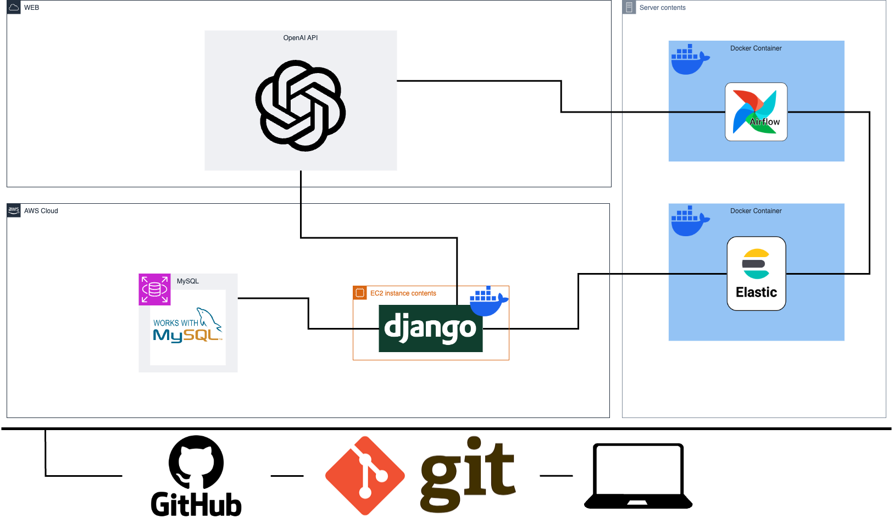

# 우대리(Woodarei)

🚧🚧 우리 FIS 아카데미 최종 프로젝트 🚧🚧

## 멤버

<table>
 <tr>
    <td align="center"><a href="https://github.com/awesome98"></td>
    <td align="center"><a href="https://github.com/eunchaipark"></td>
    <td align="center"><a href="https://github.com/euneun9"></td>
    <td align="center"><a href="https://github.com/JiyeonJeong02"></td>
    <td align="center"><a href="https://github.com/yonggaljjw"></td>
    <td align="center"><a href="https://github.com/SukbeomH"></td>
  </tr>
  <tr>
    <td align="center"><a href="https://github.com/awesome98"><b>👑 신호섭</b></td>
    <td align="center"><a href="https://github.com/eunchaipark"><b>박은채</b></td>
    <td align="center"><a href="https://github.com/euneun9"><b>이은지</b></td>
    <td align="center"><a href="https://github.com/JiyeonJeong02"><b>정지연</b></td>
    <td align="center"><a href="https://github.com/yonggaljjw"><b>조진원</b></td>
    <td align="center"><a href="https://github.com/SukbeomH"><b>홍석범</b></td>
  </tr>
</table>

## Manuals

### Git

- [git convention](./Documents/Manual/gitConvention.md)
- [git](./Documents/Manual/git.md)

## Project Structure

> [draw.io](https://app.diagrams.net/)를 이용하여 작성하였습니다.

- **Airflow**: 주기적으로 데이터를 수집하고, 전처리하는 역할을 합니다.
- **Elasticsearch**: 수집된 데이터를 저장하고, 백터화된 데이터를 저장, 검색하는 역할을 합니다.
- **Kibana**: Elasticsearch에 저장된 데이터를 시각화하는 역할을 합니다.
- **Django**: 사용자에게 데이터를 제공하고, 사용자의 요청에 따라 데이터를 Elasticsearch에서 가져와서 제공하는 역할을 합니다.
- **MySQL**: 사용자의 정보를 저장하고, Django에서 사용하는 데이터를 저장하는 역할을 합니다.

## Tech Stack

- Python 3.11
- Django 5.0
- MySQL 8.0
- Elasticsearch 7.15

# 우대리

## 프로젝트 소개
- 상품 개발 (및 마케팅)에 필요한 정보를 대시보드로 시각화 하며, 대시보드 내 정보를 챗봇을 통해 쉽게 이해하고 분석할 수 있도록 구현한 대직원 서비스

## 개발환경

- Front: HTML, CSS, JavaScript
- Back-end: 
  - Docker container
  - Port forwarding
  - Django
  - 제공된 API 활용
- 버전 및 이슈관리: 
  - GitHub
  - GitHub Issues
  - GitHub Project
- 협업 툴: 
  - Discord
  - Notion
  - GitHub Wiki
- 서비스 배포 환경: AWS

## 채택한 개발 기술과 브랜치 전략

## 프로젝트 구조

## 개발기간 및 작업관리

## 페이지별 기능

### 트러블 슈팅

## 개선 목표

## 프로젝트 후기

