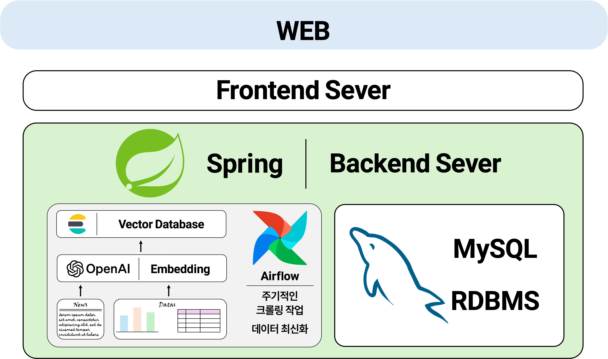
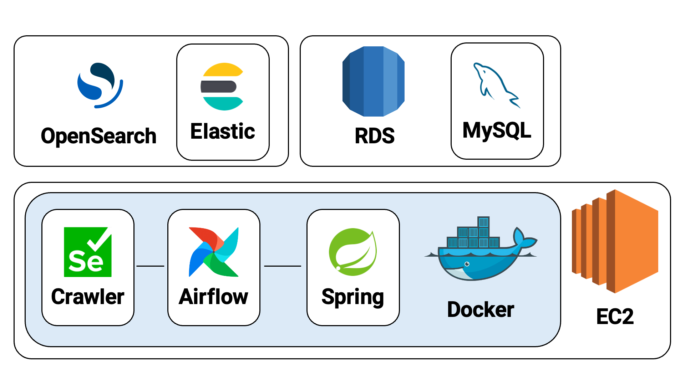

# 5조

🚧🚧 우리 FIS 아카데미 최종 프로젝트 🚧🚧

## 멤버

<table>
 <tr>
    <td align="center"><a href="https://github.com/awesome98"></td>
    <td align="center"><a href="https://github.com/eunchaipark"></td>
    <td align="center"><a href="https://github.com/euneun9"></td>
    <td align="center"><a href="https://github.com/JiyeonJeong02"></td>
    <td align="center"><a href="https://github.com/yonggaljjw"></td>
    <td align="center"><a href="https://github.com/SukbeomH"></td>
  </tr>
  <tr>
    <td align="center"><a href="https://github.com/awesome98"><b>신호섭</b></td>
    <td align="center"><a href="https://github.com/eunchaipark"><b>박은채</b></td>
    <td align="center"><a href="https://github.com/euneun9"><b>이은지</b></td>
    <td align="center"><a href="https://github.com/JiyeonJeong02"><b>정지연</b></td>
    <td align="center"><a href="https://github.com/yonggaljjw"><b>조진원</b></td>
    <td align="center"><a href="https://github.com/SukbeomH"><b>홍석범</b></td>
  </tr>
</table>

## Manuals

### Git

[git convention](./Documents/Manual/gitConvention.md)

[git](./Documents/Manual/git.md)

## Project Structure

기획 시점에서의 프로젝트 구조도는 위와 같다.

전체적으로 AWS의 서비스를 사용하여 구성할 계획이며, 변경 가능성 있음.
